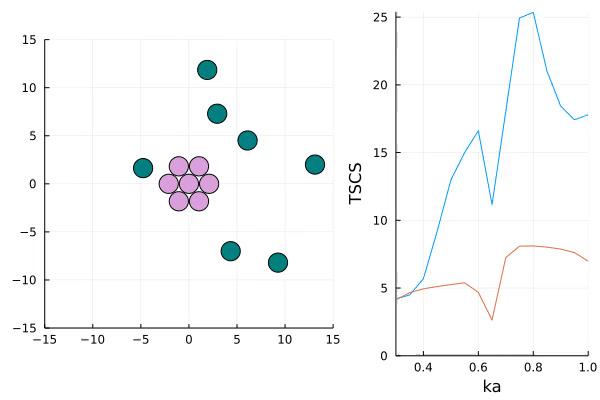

# DesignEnvironments.jl Documentation
```
                       _        _            _                      _             _     
     /\               (_)      | |          | |                    | |           | |    
    /  \    _ __ ___   _  _ __ | | __ _   _ | |  ___ __   __ __ _  | |      __ _ | |__  
   / /\ \  | '_ ` _ \ | || '__|| |/ /| | | || | / _ \\ \ / // _` | | |     / _` || '_ \
  / ____ \ | | | | | || || |   |   < | |_| || || (_) |\ V /| (_| | | |____| (_| || |_) |
 /_/    \_\|_| |_| |_||_||_|   |_|\_\ \__,_||_| \___/  \_/  \__,_| |______|\__,_||_.__/
```

```@contents
```

```@raw html
<style>
.row {
  display: flex;
}

.column {
  flex: 50%;
  padding: 5px;
}
</style>

<div class="row">
    <div class="column">
        
        <p>Figure 1: A Configuration design which manages several cylindrical scatterers on a plane. The Total Scattering Cross Section is displayed on the right.</p>
    </div>
    <div class="column">
        
        <p>Figure 2: A CoreConfiguration design. This design has a static core which acts as an object which produces scattering. The mobile cylinders are controlled by the agent with the objective of shielding the core. The scattering produced by the entire configuration is shown in blue while the core scattering is shown in orange.</p>
    </div>
</div>
```

## DesignEnvironment
```@raw html
<p>
An inverse design problem requires two components: a design, and an objective. In this package we provide an interface struct which holds these two components. The design encapsulates a physical system which can be modified through design actions. While the objective is a metric which is calculated on the design. This metric can be minimized or maximized according to the reward function.
</p>
```

```@docs
DesignEnvironment
```

## Designs
```@docs
Configuration
Configuration(;::Int, ::DE.AbstractPlane, ::Float64, ::Float64, ::Float64)
Configuration(::Matrix, ::Matrix, ::Vector, ::DE.AbstractPlane, ::Float64, ::Float64, ::Float64)
Configuration(::Any)
CoreConfiguration
```

## Objectives
```@docs
TSCS
TSCS(::Matrix)
TSCS(::Configuration)
TSCS(::CoreConfiguration)
```